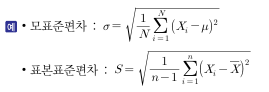
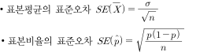

# 준비전략

### 특수한 확률분포
- 이산형 확률분포
    - 베르누이 시행
    - 이항분포
    - 포아송 분포
    - 기하분포
- 연속형 확률분포
    - 균일분포
    - 정규분포
    - 지수분포
    - 카이제곱분포
    - t분포
    - F분포
- 누적분포함수: 확률변수의 함수분포
- 변수변환 이용 확률밀도함수 계산
- 순서통계량의 분포

### 회귀분석
- 회귀분석의 기본가정
- 단순회구계수 계산
- 회귀모형의 유의성 검정
- 회귀계수의 유의성 검정
- 회귀계수의 의미
- 결정계수의 성질
- 더미변수 회귀분석

### 확률과 확률밀도함수
- 검정
- 분산분석
- 추정
- 범주형 자료 분석
- 공분산과 상관계수
- 분산분석: 일원배치 분산분석
- 범주형 자료분석: 카이제곱 독립성 검정, 동질성 검정, 적합성 검정

### 탐색적 자료분석, 대표값과 산포도, 표본추출

# 통계학의 이해

### 통계의 정의
    어떤 현상을 종합적으로 한눈에 알아보기 쉽게 일정한 쳬계에 따라 숫자로 표현
    조사를 통해 작성되며 의사결정에 활용

### 통계학의 정의
    사회현상 또는 자연현상에서 일어나는 불확실한 현상들을 수치화하여
    그 자료를 요약, 정리, 분석하고 불확실성에 대한 일반적인 규칙성을 발견하여
    최선의 판단을 내리기 위한 방법론

##### 기술통계학(Descriptive Statistics)
    수집뇓 자료를 요약, 정리하여 자료를 대표하는 수치, 표, 그래프 등으로 자료의 특성 설명

##### 추측통계학(Inferential Statistics)
    추론통계학이라고도 하며, 조사된 자료를 분석하여 
    관심대상 전체에 대해서 추측하고 일반화된 결론을 얻는 분야

### 통계학의 주요용어들
- 모집단(Population): 관심의 대상이 되는 모든 개체들의 집합
- 표본(Sample): 모집단을 가장 잘 대표할 수 있는 모집단의 일부
- 전수조사(Census): 총조사, 모집단 전부 조사 방법
- 표본조사(Survey): 모집단의 일부 조사하여 모집단 전체 특성을 추정하는 방법
- 모수(Parameter): 모집단을 대표하는 수치화된 특정한 값
- 통계량(Statistic)
    - 표본의 관측값으로부터 계산되는 확률변수로서 표본을 택할 때마다 변하는 값
    - 표본통계량이라고도 함
- 추정량(Estimator): 모집단의 모수를 추정하기 위한 사용되는 통계량
- 추정치(Estimate): 하나의 특정한 표본으로부터 계산된 추정량의 값
- 비표본오차(Nonsample Error)
    - 표본오차를 제외한 모든 오차
    - 면접, 조사표 구성방법의 오류, 조사관의 자질, 조사표작성 및 집계 과정에서의 오차
    - 전수조사와 표본조사 모두 발생
- 표본오차(Sample Error)
    - 표본자료를 근거로 얻은 결과를 모집단 전체에 대해 일반화하기 때문에 필연적 발생
    - 표본 크기 증가로 감소 가능
    - 표본조사에서 발생, 전수조사의 표본오차는 0
    - 
- 표준편차(Standard Deviation): 분산의 양의 제곱근

    

- 표준오차(Standard Error): 추정량의 표준편차

    

### 모집단과 표본의 관계
- 통계조사 목적: 모집단 분포 파악
- 일반적으로 일부만을 조사하여 모집단의 분포 추측은 매우 어려움
- 낮은 목적: 모집단 분포의 위치와 범위를 나타내는 모평균과 모분산 추측
- 표본 관측값으로부터 계산된 통계량 중에서 모수 추정에 사용되는 통계량인 추정량으로 모수 추정
- 표본 특성을 조사하여 모집단 특성 추정
- 모수 추정: 사전적 분석
- 가설 검정: 
    - 사후적 분석, 사전에 설정된 모수에 대해 가설의 진위여부 판정
    - 모집단에 대한 추측 또는 예상의 타당성을 추출한 표본을 바탕으로 평가하는 일련의 과정
     
# 기초적인 탐색적 자료 분석

### 변수의 구분
    변인, 조사대상의 관심이 되는 특성
    속성 수량화 여부: 질적/양적 변수
- 질적변수(Qualitative Variable): 수치화 불가, 성별, 종교, 국적 등
- 양적변수(Quantitative Variable): 측정에 의한 수치화
    - 연속변수(Continuous Variable)
    - 이산변수(Discrete Variable)

### 줄기와 잎 그림(Stem and Leaf Plot)
### 도수분포표(Frequency Distribution Table)
### 히스토그램(Histogram)
### 도수다각형(Frequency Polygon)
### 누적도수다각형(Ogive)
### 막대그래프(Bar Chart)
### 다섯 수치요약(Min, Q1, M, Q3, Max)
### 상자와 수염 그림(Box and Whisker Plot)

# 대표값과 산포도
### 대표값(중심위치의 측도)
### 산포도(중심위치로부처 흩어진 정도)
### 표준화점수(Standardized Scores)
### 왜도(Skewness)
### 첨도(Kurtosis)
### 분포의 형태에 따른 대표값 비교
### 기대값과 분산의 성질

# 공분산과 상관분석
### 공분산(Covariance)
### 상관계수(Correlation Coefficient)

# 확률과 확률밀도함수
### 순열(Permutation)
### 조합(Combination)
### 확률(Probability)
### 확률변수(Random Variance)

# 특수한 확률분포
### 특수한 이산형 확률분포
### 특수한 연속형 확률분포
### 확률분포의 개념 정리
### 이항분포의 정규근사
### 표본분포와 중심극한정리
### 체비셰프 부등식(Chebyshev's Inequality)
### 확률변수의 함수분포

# 추정(Estimation)
### 바람직한 추정량의 성질
### 점추정(Point Estimation)
### 점추정 방법
### 평균제곱오차(MSE, Mean Square Error)
### 구간추정(Interval Estimation)
### 구간추정의 종류
### 표본크기 결정

# 가설검정(Test of Hyperthesis)
### 가설검정의 기본 개념
### 귀무가설과 대립가설
### 검정통계량 값에 의한 검정기준
### 제1종 오류와 제2종 오류
### 가설검정 절차에 따른 검정통계량
### 결정원칙
### 가설검정의 과정
### 대립가설의 형태에 따른 기각역
### 검정력과 유의확률

# 범주형 자료분석
### 범주형 자료분석의 이해
### 범주형 자료분석의 형태

# 분산분석(Analysis of Variance)
### 분산분석의 이해
### 일원배치 분산분석(One-way ANOVA)
### 이원배치 분산분석(Two-way ANOVA)
### 혼합모형의 분산분석

# 회귀분석(Regression Analysis)
### 회귀분석의 기본개념
### 단순회귀분석(Simple Regression Analysis)
### 다중회귀분석(Multiple Regression Analysis)
### 더미변수(Dummy Variable) 회귀분석
### 교호작용(Interaction) 유무에 따른 회귀모형
### 분석방법의 결정

# 표본추출법
### 확률표본추출방법과 비확률추출방법
### 확률표본추출방법(Probability Sampling Method)
### 비확률표본추출방법(Non-Probability Sampling Method)
